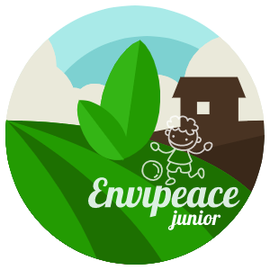

 

  

  <h3 align="center">ENVIPEACE_JUNIOR</h3>

  

    A cross platform mobile application that aims to sensitize children towards the environment
     
    <a href="https://github.com/khadijalahy1/ENVIPEACE_JUNIOR/tree/main/envipeace"><strong>Explore the docs »</strong></a>
     
     
    <a href="https://user-images.githubusercontent.com/73105975/132092985-7d9d20dd-15c0-454f-b65a-f57b82a5e627.mp4">View Demo</a>
    ·
    <a href="https://github.com/khadijalahy1/ENVIPEACE_JUNIOR/issues">Report Bug</a>
    ·
    <a href="https://github.com/khadijalahy1/ENVIPEACE_JUNIOR/issues">Request Feature</a>
  

<!-- TABLE OF CONTENTS -->

  
<h2 style="display: inline-block">Table of Contents</h2>

  <ol>
    <li>
     About the project
    </li>
    <li>
      What are the technologies used for this project?
    </li>
     <li>
      What are the challenges faced while building this application?
    </li>
    <li>
      What I've learned from this project ?
    </li>
   
  <li>Usage</li>
    <li>Next features,call to collaborate!</li>
   
  </ol>

<!-- ABOUT THE PROJECT -->
## About The Project

ENVIPEACE JUNIOR is a cross platform mobile application which is aiming to sensitize children towards the environment through interactive educational content.

This Project was designed during the Moroccan IOT and AI challenge where this last wons the third national prize.

The application contains three main rubrics:
* quizzes 
* Let's code
* Training

https://user-images.githubusercontent.com/73105975/132092985-7d9d20dd-15c0-454f-b65a-f57b82a5e627.mp4

## What are the technologies used for this project ?

This Project was built using [JavaScript] as a programming language and the following technologies:
* [ReactNative]
* [NodeJs]
* [Firebase]

<!-- GETTING STARTED -->
## What are the challenges faced while building this application?

We did the first version of this application using expo. The application has been so slow and after some real research on this topic, there are some tips to maximize the performance of your ReactNative application:

* Cache images and videos before using them (you can use react-native-f's)
* Don't forget to delete all the console.log before publishing the application.
* Use Memoization: for classes -> use React.PureComponent instead of normal components, for functions -> use React.memo
* This library allows you to load images more quickly: react-native-fast-image
* Enable Hermes (A JS engine to optimize app start time, reduce APK size, and memory footprints)

Keep in mind that all those libraries can only be used while using react-native cli they are not figuring yet among expo libraries :)

References :

. https://medium.com/@gauravsapiens/react-native-making-your-app-fast-again-d00d02ee2b2a  
. https://github.com/facebook/react-native/issues/30403  
. https://www.youtube.com/watch?v=jTdi9oTM22c&t=773s  

### What I've learned from this project ?

* React-Native framework
* NodeJs Api calls
* How To use android studio and sdk
* How filesystem works on react native and how to use react-native-fs to cache files .

### Try it on your device

1. download the apk file : https://firebasestorage.googleapis.com/v0/b/speedlearning-fbd64.appspot.com/o/envipeace_junior%2Fapp-debug.apk?alt=media&token=2ea90f0a-6b65-4d61-8117-d195f5abea37

2. Install it on your phone/emulator and test it:)

<!-- ROADMAP -->
## Next Features , call to collaborate :smile:
We are planning to make this application more attractive and more engaging by envolving a creative gamification.

<!-- CONTRIBUTING -->
## Contributing

Contributions are what make the open source community such an amazing place to learn, inspire, and create. Any contributions you make are **greatly appreciated**.

1. Fork the Project
2. Create your Feature Branch (`git checkout -b feature/AmazingFeature`)
3. Commit your Changes (`git commit -m 'Add some AmazingFeature'`)
4. Push to the Branch (`git push origin feature/AmazingFeature`)
5. Open a Pull Request

<!-- LICENSE -->
## License

Distributed under the MIT License. See `LICENSE` for more information.

